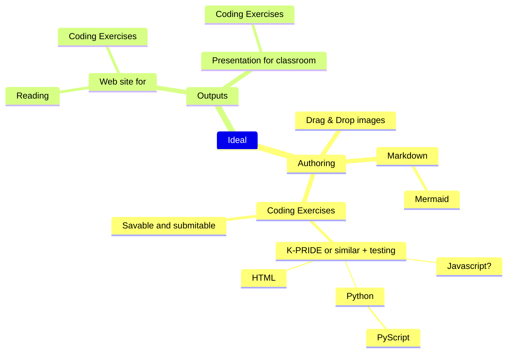

## Possible Technologies

https://github.com/davidvkimball/obsidian-astro-composer

## Pyscript

- https://pyga.me/docs/
- https://docs.pyscript.net/2025.11.2/beginning-pyscript/
- https://pyscript.com/