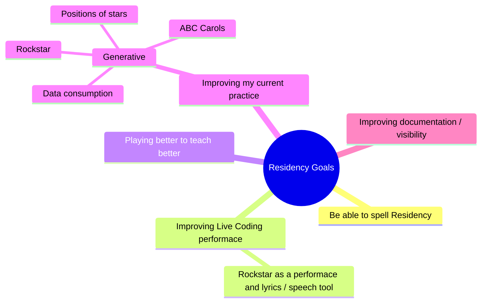

Before the session please spend a bit of time thinking about your goals   
and come with ideas on what you can share with the group (this may not   
be directly related to live coding, but may be related to your existing   
creative practice) as well as what you want to get out of the programme.  
Agenda:  
Morning - introductions and goals! We will create a shared agreement on   
communication and conduct (facilitated by Lucy)  
Afternoon: talking about what you can offer and what you'd like to get   
out of the residency, planning future sessions around this and thinking   
about our goals in a bit more detail (facilitated by Ray)  
We also have an unstructured session pencilled in on Sunday 17th   
11:00-3:00 - we will decide if/what to do in this session during the   
Saturday :)

---

---

## Recent Stuff
 
- https://medium.com/@stretchyboy/my-live-coding-journey-gets-a-nice-kick-drum-0ad8b8b07ddf
- https://stretchyboy.github.io/cherry-strudel/
- https://github.com/stretchyboy/rockstar-strudel

- https://shop.codewithrockstar.com/product/certified-rockstar-developer-red/